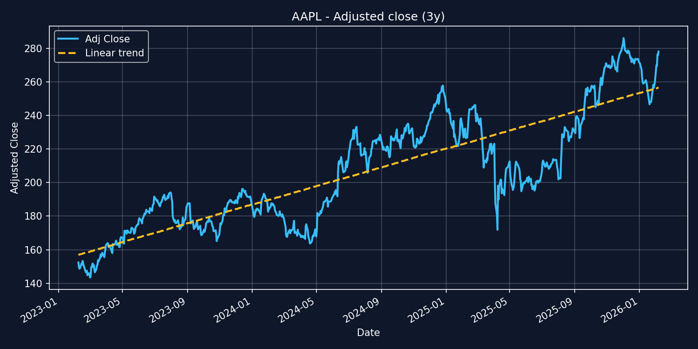

# market-analysis-engine

## Disclaimer

This project is intended for educational and personal use only.

The application retrieves financial data via `yfinance`, which in turn sources data from Yahoo Finance. The authors of this project do not own, control, or guarantee the accuracy, availability, or licensing of this data.

Users are solely responsible for:
- Ensuring compliance with the terms of service of Yahoo Finance and `yfinance`
- Verifying the legality of storing, processing, or redistributing any retrieved data
- Assessing the suitability and correctness of the data for their use case

The authors assume no responsibility or liability for any decisions, financial or otherwise, made based on data obtained through this application.

If you intend to use this system in a production or commercial setting, you should implement your own data provider integration and ensure full compliance with applicable laws and data licensing terms.

### Description

A Python application for collecting, storing and analyzing financial
market data, built on top of a modular command-driven architecture with
CLI and API interfaces.

> **Note**
>
> This project is currently being migrated and amalgamated from the python-project-blueprint template and an older iteration of this project.
> The Docker setup and GitHub actions is not currently working with postgres
> Not all analysis-methods have been migrated over, currently only linear regression works
> This project is being continously updated.

### What this is

This repository is a **concrete implementation** built on top of
`python-project-blueprint`.

It provides: - A structured system for fetching and storing market data
(e.g. via yfinance) - A database-backed backend (PostgreSQL) for
persistent storage - A command-driven architecture for extensibility
(data ingestion, analysis, retrieval) - A foundation for future
ML/AI-driven analysis pipelines

## Table of contents:

-   Quick start
-   Features
-   Architecture
-   Installation
    -   Requirements
    -   Setup
    -   Usage
    -   Testing
-   Docker & Github Actions
    -   Local docker usage
    -   GitHub Actions setup

## Quick Start

``` bash
git clone https://github.com/kjetilpaulsen/market-analysis-engine.git
cd market-analysis-engine
uv sync
uv run python -m market_analysis_engine cli version
```

## Features

-   Dual entrypoints: CLI and FastAPI (HTTP API)
-   Command → Handler → Event pipeline for decoupled execution
-   Integration with financial data sources (e.g. yfinance)
-   PostgreSQL-backed persistence layer
-   Structured runtime configuration (env → config → defaults)
-   XDG-compliant directory layout
-   Configurable logging system (file + console)
-   Typed command/event system for predictable execution
-   Extensible command system (e.g. fetch data, store data, query data)
-   Test suite with pytest + coverage
-   Docker support for API deployment
-   CI/CD via GitHub Actions

## Architecture

### Architecture

[Architecture](docs/architecture.md)

### Flow

[Flow](docs/flow.md)

## Installation

### Requirements

-   **Python** ≥ 3.11 (recommended: 3.12--3.14)
-   **uv**
-   **PostgreSQL**

### Setup

``` bash
git clone https://github.com/kjetilpaulsen/market-analysis-engine.git
cd market-analysis-engine
uv sync
```

Optional:

``` bash
source .venv/bin/activate
```

### Usage

Show available commands:

``` bash
uv run python -m market_analysis_engine cli -h
```

Example commands (may evolve during development):

Fetch market data(this will gather an updated list of all tickers on most US exchanges, and then start downloading daily values for as far back as possible with maximum date of 1975.01.01. This will create *a lot* of traffic. Instead use the `--dev` flag to just do a test run with 7 preselected tickers):

``` bash
uv run python -m market_analysis_engine cli --dev updateall
```
Assuming you have the data for e.g. `AAPL` available, the following command will display a graph of the ticker closing values for the given period. It will also overlay a linear regression analysis based on the same period.
``` bash
uv run python -m market_analysis_engine cli display-graph --ticker=AAPL --period=3y
```
The result will be stored in your `XDG_DATA_HOME` folder, e.g. `~/.local/share/market-analysis-engine/AAPL_3y.png`. If using kitty terminal, the output will be displayed directly in your terminal and looks like this:


Run API:

``` bash
uv run python -m market_analysis_engine api
```

Test API:

``` bash
curl http://127.0.0.1:8000/health
```

Run command via API this will also create a lot of traffic. Take care that running through the API there are no way to set runtime-conditions like `--dev` unless you create an .env file. See .env.example for an example layout:

``` bash
curl -X POST http://127.0.0.1:8000/run \
  -H "Content-Type: application/json" \
  -d '{
    "commands": [
      { "name": "updateall", "options": {} }
    ]
  }'
```

Build config:

``` bash
uv run python -m market_analysis_engine cli --build-config
```

### Testing

``` bash
uv run pytest
```
With coverage:

``` bash
uv run pytest -V --cov=market_analysis_engine --cov-report=term-missing
```

## Docker & GitHub Actions Setup

### Overview

-   Docker: API container
-   Docker Compose: local orchestration
-   GitHub Actions: test → build → push

## Local Docker Usage

### 1. Create `.env`

``` env
IMAGE_NAME=<your-dockerhub-username>/<your-image-name>
IMAGE_TAG=latest

LOG_LEVEL=DEBUG
CONSOLE_LOG=true
STDERR_LOG=true
```

### 2. Run

``` bash
docker compose up --build
```

Stop:

``` bash
docker compose down
```

Test:

``` bash
curl http://127.0.0.1:8010/health
```

## GitHub Actions usage

### Setup secrets

```env
DOCKERHUB_USERNAME=<your-dockerhub-username>
```
```env
DOCKERHUB_TOKEN=<your-dockerhub-access-token>
```
```env
IMAGE_NAME=<your-dockerhub-username>/<your-image-name>
```
```env
IMAGE_TAG_LATEST=<image-name>
```
```env
PREFIX_SHA=<image-name>
```

On push to `release` branch: - Runs tests - Builds Docker image - Pushes
to DockerHub

