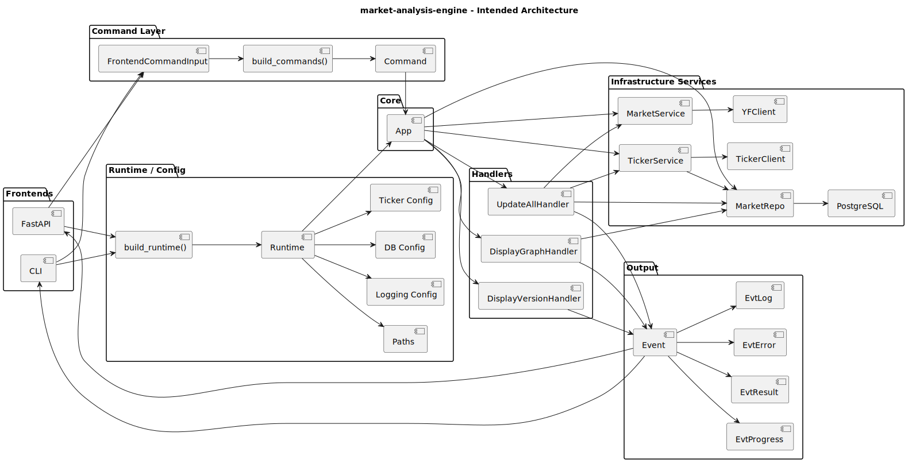

# Architecture

## Overview

The application is built around a **shared command-driven backend** for market data ingestion, storage, and analysis.

It separates:
- input (`CLI` / `FastAPI`)
- command translation (`FrontendCommandInput` → `build_commands()` → `Command`)
- execution (`App` + handlers)
- infrastructure (runtime/config, database, external data clients, filesystem paths)
- output (`Event` stream)

This allows the same backend to be reused from multiple frontends while keeping business logic and infrastructure wiring centralized.

---

## Components

### Frontends
- `CLI`
- `FastAPI`

These are thin entry layers responsible for:
- receiving user input
- parsing/normalizing requests
- invoking the shared application core
- presenting returned events

The CLI is the richer frontend right now, while the API already exposes the same backend model and can be expanded over time.

---

### Command Layer

- `FrontendCommandInput`
- `build_commands()`
- `Command`
- Concrete commands such as:
  - `CmdDisplayVersion`
  - `CmdUpdateAll`
  - `CmdDisplayGraph`

This layer converts external input into structured, executable commands.

It acts as the boundary between frontend-specific parsing and backend execution.

---

### Core (`App`)

The `App` is the central orchestrator.

It:
- receives executable commands
- initializes and owns the shared runtime dependencies
- resolves each command to a matching handler
- streams events back to the caller

The `App` wires together:
- database connection and schema setup
- repository access
- market data client/service
- ticker reconciliation/update service
- handler dispatch table

---

### Runtime / Configuration

The runtime is built once from:
- metadata
- XDG-style paths
- environment/config/default settings
- optional CLI/API overrides

It provides grouped configuration for:
- app metadata
- filesystem paths
- logging
- database connection
- development flags
- ticker/update behavior

This keeps infrastructure concerns out of the frontends and handlers.

---

### Data / Infrastructure Services

The core execution path depends on several infrastructure services:

#### Database layer
- PostgreSQL connection
- schema creation
- `MarketRepo` persistence layer

This layer is responsible for:
- ensuring instruments exist
- storing OHLCV market data
- querying stored series for later analysis/plotting
- tracking last update dates

#### Market data layer
- `YFClient`
- `MarketService`

This layer fetches market data from the external provider and normalizes it into data structures suitable for storage and analysis.

#### Ticker layer
- `TickerClient`
- `TickerService`

This layer:
- retrieves the currently active ticker universe
- reconciles active tickers against the database
- determines where updates should resume from
- flags cases where corporate actions may require a larger backfill

---

### Handlers

Each command is executed by a corresponding handler.

Examples in the current design:
- `DisplayVersionHandler`
- `UpdateAllHandler`
- `DisplayGraphHandler`

Handlers:
- encapsulate application logic
- depend on services injected by `App`
- emit progress/log/result/error events
- remain independent of CLI/API presentation details

---

### Events

Events are the output abstraction used across the system.

Current event types include:
- `EvtLog`
- `EvtProgress`
- `EvtResult`
- `EvtError`

This means the backend does not return raw frontend-specific output.  
Instead, frontends decide how events should be rendered, logged, serialized, or displayed.

---

## Intended command paths

### Version path
Used as a simple verification command:
- frontend request
- command creation
- `DisplayVersionHandler`
- `EvtResult`

### Update-all path
Used for market ingestion:
- ticker universe refresh
- DB reconciliation
- fetch OHLCV data
- detect corporate actions when needed
- upsert data into PostgreSQL
- emit progress/log events

### Display-graph path
Used for lightweight analysis/visualization:
- query stored series from DB
- build trend/plot
- save image to app data directory
- optionally display in Kitty terminal

---

## Design Principles

- Separation of concerns
- Shared backend across CLI and API
- Command/handler decoupling
- Event-based output
- Explicit runtime/config wiring
- Database-backed persistence
- Extensibility for future analytics and ML-oriented workflows
