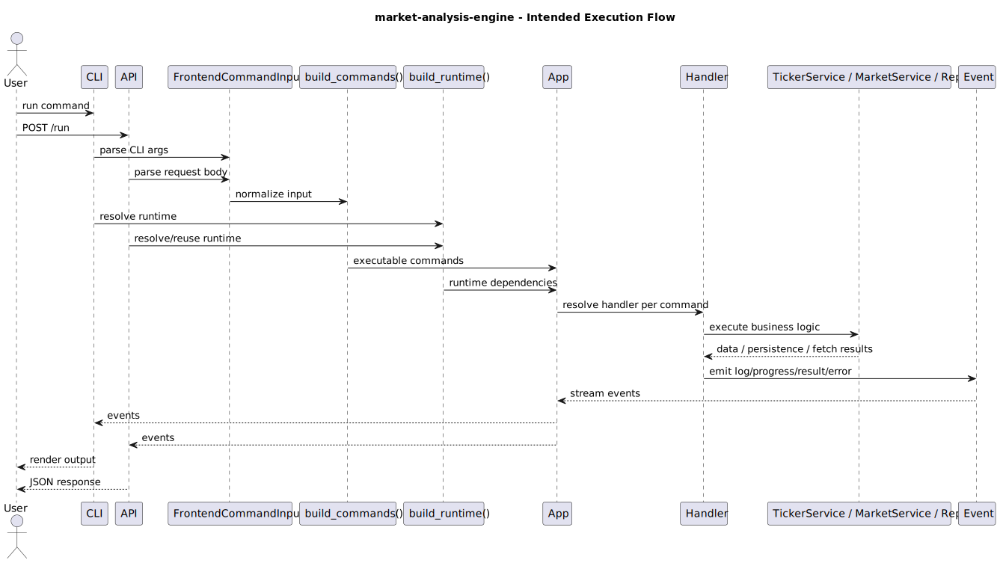

# Execution Flow

## Step-by-step

1. User triggers a command through the `CLI` or `API`
2. Frontend input is parsed into `FrontendCommandInput`
3. `build_commands()` converts the input into concrete internal `Command` objects
4. Runtime is built or reused (`metadata`, `paths`, `logging`, `database`, `ticker settings`, etc.)
5. The frontend constructs `App(...)` with the resolved runtime
6. `App.run()` iterates through incoming commands
7. For each command, `App` resolves the matching handler
8. The handler uses the required services (`MarketRepo`, `TickerService`, `MarketService`, etc.)
9. The handler emits `Event` objects such as logs, progress, results, or errors
10. Events flow back through `App` to the frontend
11. The frontend renders or serializes the events for the user

---

## Update-all flow

For the market update path, the execution is roughly:

1. User runs `updateall`
2. Frontend builds `CmdUpdateAll`
3. `App` resolves `UpdateAllHandler`
4. `UpdateAllHandler` asks `TickerService` for the ticker update plan
5. `TickerService`:
   - fetches the active ticker list
   - reconciles instruments with the DB
   - determines each ticker's update start date
6. For each ticker, `UpdateAllHandler`:
   - requests OHLCV data from `MarketService`
   - checks for corporate actions if relevant
   - performs a broader backfill when needed
   - stores/upserts data through `MarketRepo`
   - emits progress/log events
7. Frontend shows progress and completion output

---

## Display-graph flow

For graph generation, the execution is roughly:

1. User runs `display_graph`
2. Frontend builds `CmdDisplayGraph`
3. `App` resolves `DisplayGraphHandler`
4. Handler fetches adjusted close data from `MarketRepo`
5. Handler generates and saves a plot image
6. Handler optionally displays the image in Kitty
7. Frontend receives log/result-style events

---

## Key idea

The system is built around **commands in, events out**.

That gives:
- a unified execution model
- reusable backend logic
- frontend independence
- support for streaming progress during longer-running data updates
- a clean path for extending the engine with additional analysis commands later
